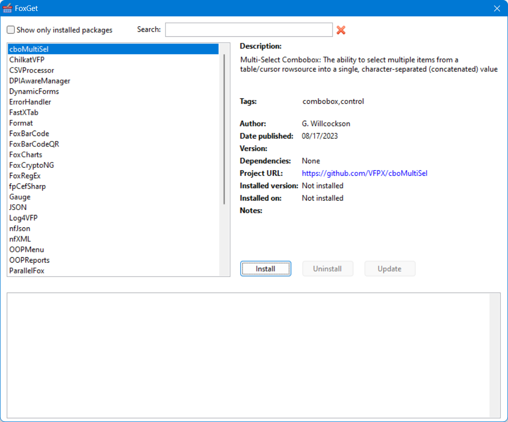

# FoxGet

If you've worked with Visual Studio, you've likely used NuGet, which is a package manager for .NET. The idea is that you can search for libraries you'd like to add to your application, download and install them, and then have them managed (automatically download again if files are missing, update to a new version, etc.). FoxGet is the VFP equivalent of NuGet.

The idea is that you run FoxGet when want to add a library to an application. You search for a library you're interested in and if one is found, you can download, install, and add it to your project with a single mouse click. Of course, you'll have to do the coding part such as calling the library yourself.

Note: in this documentation, "package" means a library you want to add to your application.

## Using FoxGet

Open the project for your application and DO FoxGet.app in the FoxGet folder.



Select a package to see information about it at the right, including the version and date the package was installed in the project if it was installed. Click the link for _Project URL_ to go to the home URL for the package.

You can search for a package by name, tag, or description by typing in the Search textbox. To show only packages installed in the current project, turn on _Show only installed packages_.

To install the selected package, click Install; that button is disabled if the package has already been installed. After a moment, you should see that some files were added to the project and there's a Packages subdirectory of the project folder containing Packages.xml and the downloaded files in a folder for the component. The package folder also contains a file named <i>Package</i>Installer.prg, which is used to uninstall the package.

You may wonder why FoxGet puts the library into a Packages subdirectory of the project folder rather than in a common location other applications could reference. There are several reasons:

- That's the way NuGet works.
- If your application is in source control (such as Git), it isn't easy to include paths outside the application path in the repository.
- You may want to use different versions of a library in different applications, especially if how you call the library changes between versions.

To uninstall the selected package, click the Uninstall button. The files added to the project by the installer are removed from the project, the package folder in the Packages subdirectory is deleted, and Packages.xml is updated.

If there's a newer version of the package available, the Update button is enabled. Clicking it uninstalls the package then installs the new version.

## Creating an installer
If you interested in writing your own installer, check out the various installer PRGs to see how little code there is, as FoxGet.prg takes care of most of the tasks. For some of them (e.g. CSVProcessor and DynamicForm), it's just specifying what files to download and which to add to the project. Others (e.g. ParallelFox and XLSXWorkbook) have more work to do, such as unzipping the download and copy some or all of the files to the package folder.

Here's a simple installer. It just downloads a single file, dpiawaremanager.prg from https://raw.githubusercontent.com/atlopes/DPIAwareManager/master/source, and adds it to the project.

```
define class DPIAwareManagerInstaller as FoxGet of FoxGet.prg
    cBaseURL = 'https://raw.githubusercontent.com/atlopes/DPIAwareManager/master/source/'

* Define the file to download. Note that URLs are case-sensitive. Also, we'll
* download directly to the package folder since there's nothing to unzip, and
* we'll add the file to the project. Since FoxGet does all that, there are
* no custom tasks to perform.

    function Setup
        This.AddFile('dpiawaremanager.prg', .T., This.cPackagePath)
    endfunc
enddefine
```

Here are some notes:

- The installer program defines a subclass of FoxGet in FoxGet.prg.

- The installer class name and PRG must be the same and match the name in the Name column of FoxGetPackages.dbf with an "Installer" extension. For example for the DPIAwareManager package, the installer name is DPIAwareManagerInstaller.prg and the class in that file is named DPIAwareManagerInstaller.

- Setup performs custom setup tasks and is normally used to define what files to download. The AddFile method called by Setup accepts three parameters:

    - The URL of the file to download. Note that URLs are case-sensitive. Also, if you're downloading more than one file from the same site, set the BaseURL property as this class does and the just specify the filename to download in AddFile. Note that for GitHub, the file isn't located at https://github.com/<i>repository</i>/<i>branch</i>/<i>somefile</i> but instead at https://raw.githubusercontent.com/<i>repository</i>/<i>branch</i>/<i>somefile</i>.
    - .T. to add this file to the project.
    - Optionally, a path to download this file to. If it isn't specified, the file is downloaded to a temporary path. In this case, since we don't have anything else to do with the file (such as extracting it if it's a ZIP file), we'll download directly to the folder for the package, specified in the cPackagePath property.

FoxGet creates the Packages folder if it doesn't already exists, create a folder for the package in Packages, downloads all files you specified by calling AddFile, adds them to the project if the second parameter to AddFile is .T., and updates Packages\Packages.xml. So, in this installer, there's nothing custom we have to do other than specifying the file to download.

Here's a more complicated installer.

```
define class XLSXWorkbookInstaller as FoxGet of FoxGet.prg
    cBaseURL = 'https://raw.githubusercontent.com/ggreen86/XLSX-Workbook-Class/master/'

* Define the file to download. Note that URLs are case-sensitive.

    function Setup
        This.AddFile('WorkbookXLSX%20R39.zip')
    endfunc

* Custom installation tasks: copy just the class library and include file from
* the extraction folder to the package folder and add the VCX to the project.

    function InstallPackage
        local llOK
        llOK = This.CopyExtractedFiles('vfpxworkbookxlsx.*')
        llOK = llOK and This.AddFileToProject('vfpxworkbookxlsx.vcx')
        return llOK
    endfunc

* Custom uninstallation tasks: remove the VCX from the project.

    function UninstallPackage
        local llOK
        llOK = This.RemoveFileFromProject('vfpxworkbookxlsx.vcx')
        return llOK
    endfunc
enddefine
```

Here are some notes:

- There's only one file to download: a ZIP file containing the project files.
- InstallPackage is a method where you can put custom installation tasks. FoxGet automatically extracts a ZIP file to a temporary folder so in this method we'll copy just certain files (vfpxworkbookxlsx.vcx, vct, and h) to the package folder; we'll skip the documentation and sample code. We'll also add the vcx to the project. Since each step could fail for some reason, we check the return value and only continue if it succeeded.
- UninstallPackage is a method where you can put custom uninstallation tasks. In this case, since we manually added the file to the project, we have to call RemoveFileFromProject to remove it.

To create your own installer, do one of the following:

- Fork this repository, create the installer PRG in the Installers folder, add a record for it to FoxGetPackages.dbf in the Installers folder, and create a pull request.
- Create the installer, create a new Feature Request (under Issues) in this repository, attach the PRG, and specify the values for the FoxGetPackages record.

## ToDo

There are a few things to do:

-   Add to Thor Check for Updates
-	Writing installers for more components
-	Some components need to go into a common place rather than the Packages subdirectory of a project folder. For example, ParallelFox.exe since it’s a COM object that gets registered.
-	Adding files to the project’s repository if there is one.

## Release History

### 2023-12-26

* Implemented UI and more features.

### 2023-12-24

* Initial release.
