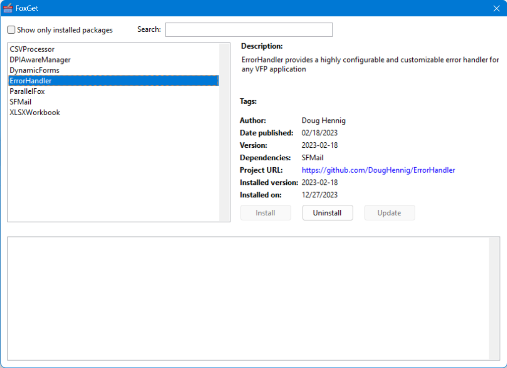

[](https://github.com/DougHennig/FoxGet/actions/workflows/CPVU.yml)


# FoxGet Package Manager
[English](README.md)|[简体中文](README_CN.md)

如果你使用过 Visual Studio，你很可能使用过 NuGet，它是 .NET 的软件包管理器。其原理是，您可以搜索要添加到应用程序中的库，下载并安装它们，然后对它们进行管理（如果文件丢失会自动再次下载，更新到新版本等）。FoxGet 相当于 VFP 的 NuGet。

FoxGet 的基本原理是，当你想在应用程序中添加一个库时，就运行它。您可以搜索感兴趣的库，如果找到只需单击鼠标即可下载、安装并将其添加到项目中。当然，你必须自己完成编码部分，如调用库。

注意：在本文档中，“软件包”指的是要添加到应用程序中的库。

## 使用 FoxGet

打开应用程序的项目，在 FoxGet 文件夹中 DO FoxGet.app。



选择一个软件包，即可在右侧看到该软件包的相关信息，包括版本和安装在项目中的日期（如果已安装）。单击 _项目URL(Project URL)_ 链接，转到软件包的主页 URL。

在 “搜索(Search)” 文本框中输入(软件包)名称、标记或描述，即可搜索软件包。如果仅显示当前项目中已安装的软件包，请选择 _只显示已安装的软件包(Show only installed packages)_。

如果需要安装所选软件包，可点击 安装(Install) 按钮；如果所选软件包已安装，则该按钮被禁用。稍等片刻后，你会看到一些文件被添加到项目中，项目文件夹中则添加一个软件包子目录，其中包含 Packages.dbf 和下载的文件，组件子目录中包含下载的文件。软件包子目录还包含一个名为 Package Installer.prg 的文件，用于卸载软件包。

你可能会问，为什么 FoxGet 要把库放到项目文件夹 Packages 子目录下的一个子目录中，而不是放到其他应用程序可以引用的普通位置。这是基于以下几个原因：

- 这是 NuGet 的运行方式。

- 如果您的应用程序使用某种源代码管理工具(如 Git)，要在版本库中包含应用程序路径之外的路径并不容易。

- 您可能希望在不同的应用程序中使用不同版本的库，尤其是当您调用库的方式在不同版本之间发生变化时。

由于软件包存储在自己的文件夹中，如果在 VFP IDE 中运行应用程序，则需要设置这些文件夹的路径。

要卸载所选软件包，请单击 卸载(Uninstall) 按钮。安装程序添加到项目中的文件将从项目中移除，Packages 子目录中的软件包文件夹将被删除，Packages.dbf 将被更新。

如果软件包有更新的版本，更新(Update) 按钮就会启用。点击该按钮会卸载软件包，然后安装新版本。

## 依赖关系
有些项目(软件包)依赖于其他项目。例如，[ErrorHandler](https://github.com/DougHennig/ErrorHandler) 使用 [SFMail](https://github.com/DougHennig/SFMail)，而 SFMail 本身也使用 [wwDotNetBridge](https://github.com/RickStrahl/wwDotnetBridge)。FoxGetPackages.dbf 包含每个软件包的相关信息，其中的 Dependent 列包含一个软件包所依赖的其他软件包的名称。安装软件包时，也会安装所有依赖包(已安装的依赖包会重新安装)。卸载软件包时，只要不依赖其他软件包，也是作为独立软件包安装，依赖包也会被卸载。

请注意，依赖包放在它们自己的软件包文件夹中，因此如果在 VFP IDE 中运行应用程序，需要设置这些文件夹的路径。

## FoxGet 与 Thor 检查更新有何不同

[Thor](https://github.com/VFPX/Thor) 有一个检查更新(CFU)功能，可以安装和更新项目。虽然这对 “工具”(在 VFP IDE 中使用的项目,例如 GoFish 等)非常有效，但它不太适合安装 “组件”(为应用程序添加功能的项目)：

- Thor 会将项目安装在自己文件夹的子目录下，而不是应用程序下，这使得源代码控制和路径选择更加棘手。

- Thor 不会列出所有项目，只会列出项目经理配置为可与 Thor CFU 协同工作的项目。FoxGet 也不会列出所有项目，但可以在不更新项目存储库的情况下扩展项目。

## 创建安装包
如果你有兴趣编写自己的软件包安装程序，可以查看 Installers 文件夹中的各种安装程序 PRG，这仅需少量的代码，因为 FoxGet.prg 会处理大部分任务。对于其中一些(如 CSVProcessor 和 DynamicForm)，只需指定下载哪些文件以及将哪些文件添加到项目中即可。另一些(如 ParallelFox 和 XLSXWorkbook)则需要做更多工作，如解压缩下载文件并将部分或全部文件复制到软件包文件夹。

下面是一个简单的安装程序。它只需下载一个文件并将其添加到项目中。

```foxpro
define class DPIAwareManagerInstaller as FoxGet of FoxGet.prg
    cBaseURL = 'https://raw.githubusercontent.com/atlopes/DPIAwareManager/master/source/'

* 定义要下载的文件。请注意，URL 区分大小写。
* 此外，由于无需解压缩，我们将直接下载到软件包文件夹，并将文件添加到项目中。
* 由于 FoxGet 会完成所有这些工作，因此无需执行自定义任务。

    function Setup
        This.AddFile('dpiawaremanager.prg', .T., This.cPackagePath)
    endfunc
enddefine
```

下面是一些注意事项：

- 安装程序定义了 FoxGet.prg 中 FoxGet 的子类。

- 安装程序类名称和 PRG 必须相同，并与 FoxGetPackages.dbf 名称列中带有 “Installer ”扩展名的名称相匹配。例如，对于 DPIAwareManager 软件包，安装程序名称为 DPIAwareManagerInstaller.prg，该文件中的类名为 DPIAwareManagerInstaller。

- Setup 执行自定义安装任务，通常用于定义要下载的文件。Setup 调用的 AddFile 方法接受三个参数：

    - 要下载文件的 URL。请注意，URL 区分大小写。此外，如果要从同一网站下载多个文件，可像该类一样设置 BaseURL 属性，然后在 AddFile 中指定要下载的文件名即可。请注意，对于 GitHub，文件的位置不是 https://github.com/<i>repository</i>/<i>branch</i>/<i>somefile</i>，而是 https://raw.githubusercontent.com/<i>repository</i>/<i>branch</i>/<i>somefile</i>。
    
    - .T. 表示将此文件添加到项目中。
    
    - 可选项，下载文件的路径。如果没有指定，文件将下载到一个临时路径。在本例中，由于我们对文件没有其他处理（例如解压缩 ZIP 文件），我们将直接下载到 cPackagePath 属性中指定的软件包文件夹。

如果 Packages 文件夹不存在，FoxGet 会创建 Packages 文件夹，在 Packages 中为软件包创建文件夹，通过调用 AddFile 下载指定的所有文件，如果 AddFile 的第二个参数是 .T.，则将它们添加到项目中，并更新 Packages\Packages.dbf 文件。因此，在这个安装程序中，除了指定要下载的文件外，我们不需要做任何其他自定义操作。

下面是一个更复杂的安装程序。

```foxpro
define class XLSXWorkbookInstaller as FoxGet of FoxGet.prg
    cBaseURL = 'https://raw.githubusercontent.com/ggreen86/XLSX-Workbook-Class/master/'

* 定义要下载的文件。请注意，URL 区分大小写。

    function Setup
        This.AddFile('WorkbookXLSX%20R39.zip')
    endfunc

* 自定义安装任务：仅将类库和包含文件从解压缩文件夹复制到软件包文件夹，
* 然后将 VCX 添加到项目中。

    function InstallPackage
        local llOK
        llOK = This.CopyExtractedFiles('vfpxworkbookxlsx.*')
        llOK = llOK and This.AddFileToProject('vfpxworkbookxlsx.vcx')
        return llOK
    endfunc

* 自定义卸载任务：从项目中移除 VCX。

    function UninstallPackage
        local llOK
        llOK = This.RemoveFileFromProject('vfpxworkbookxlsx.vcx')
        return llOK
    endfunc
enddefine
```

下面是一些注意事项：

- 只需下载一个文件：包含项目文件的 ZIP 文件。

- InstallPackage 是一种可以放置自定义安装任务的方法。FoxGet 会自动将 ZIP 文件解压缩到临时文件夹中，因此在本方法中，我们将只复制某些文件（vfpxworkbookxlsx.vcx、vct 和 h）到软件包文件夹中；我们将跳过文档和示例代码。我们还将把 vcx 添加到项目中。由于每个步骤都可能因某些原因而失败，因此我们会检查返回值，只有在成功时才继续。

- UninstallPackage 是一种可以放置自定义卸载任务的方法。在本例中，由于我们手动将文件添加到了项目中，因此必须调用 RemoveFileFromProject 将其删除。

要测试安装程序，请在 FoxGet.app 所在文件夹的 MyPackages.dbf 中创建一条记录，并在 InstallURL 字段中指定安装程序 PRG 的路径(例如，“C:\FoxGet\TestInstaller.prg”)。在测试文件夹中创建一个测试项目，运行 FoxGet.app，然后安装软件包。测试完成后，可以删除 MyPackages.dbf 中的记录(也可以不删除；见下文)。

要部署安装程序，请执行以下操作之一：

- Fork 该版本库，复制 Installers 文件夹中的安装程序 PRG，在 Installers 文件夹中的 FoxGetPackages.dbf 中添加一条记录，然后创建一个 pull request。

- 创建安装程序，在该版本库中创建一个新的功能请求(在 Issues 下)，附加 PRG，并指定 FoxGetPackages 记录的值。

- 如果不想共享安装程序，只需保留 MyPackages.dbf 中的记录即可。安装程序将仅供您使用。

## 帮助本项目

如果您想帮助本项目，详情请参阅[如何帮助 FoxGet](.github/CONTRIBUTING_CN.md)。

## 发布

本工具的发布信息请参见[更新历史](ChangeLog_CN.md)。
